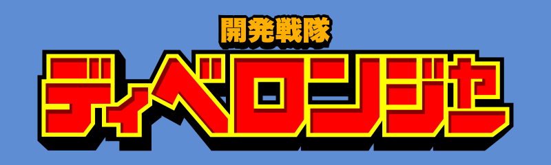

# KSENTAIフォント

戦隊風のカタカナを適当に再現したfontです。  
ちょっと加工してますが、以下のような感じのfontになります。

## 使い方
[こちら](https://github.com/bu-kurokky/font/raw/main/ksentai.zip)をDLして解凍してお使いください。  
ちょっと変わった使い方ですが、「"」や「。」で濁音や半濁音のテンとマルを別のセットにしています。  
そちらを使う場合は、通常の「カ"」と入力するか、サブセットに少し細めのfontを「ひらがな」に登録しています。
（「か"」と入力すると、それっぽい感じになると思います。）  

「-」「ー」半角マイナスとハイフンで出るfontが微妙に違います。

## ご注意

思いつき+特急で作ったので結構ズレてたりするのでパス化してパスの最適化や端を揃える作業することをおすすめします。

## ライセンス
権利は作者であるkurokkyに属しますが、BSDライセンスになります。

## サンプル
以下、サンプルです。

### カタカナ

### 小文字、記号

### 濁音、半濁音

### サブセット（濁音用）

## その他
作成秘話的なのは[note](https://note.com/kurokky/n/n9a2fd019f04e)に記載しています。  
もし、DLした際には「いいね！」でもしてください。