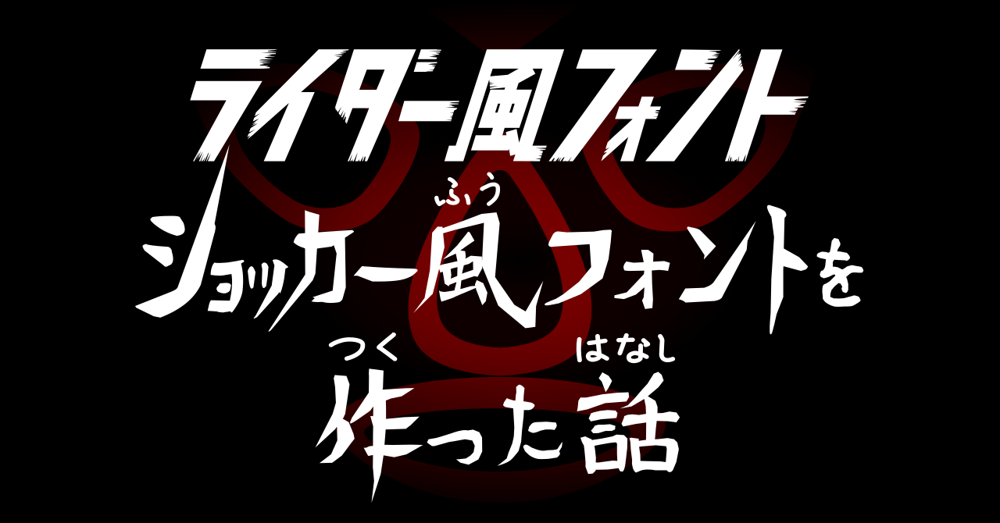

# K本郷フォント、K光太郎フォント、Kイー！フォント

初代ライダーの次回予告、およびロゴ風のカタカナを適当に再現したfontです。  
次回予告風は結構加工してますが、以下のような感じのfontになります。

## 使い方
Kイー！フォントについてはかなり癖があるフォントです。覚悟の上[こちら](https://github.com/bu-kurokky/font/raw/main/rider.zip)をDLして解凍してお使いください。  
ライダー風のロゴであれば、KEEE!フォントはいらないと思います。

KEEEフォントについては「!」「！」半角全角の!で出るfontが微妙に違います。

## DLする前にどういう文字が使えるのか確認したい

こちらに簡易検証ページを用意しました。DL前に使いにくさを始め感じをつかめると思います。

## 次回予告風にするTips

本郷フォント・光太郎フォントについては、カーニングを調整すればそこそこ「っぽく」なるはずです。  
問題は、イー！フォントの方ですが、挑戦しようとする奇特な方は以下の方法で挑戦してみてください。  
([Inkscape](https://inkscape.org/ja/)、イラストレーターなどのドローソフトが必要になります。)  

1. まず、こちらで自分が考えた文字列のfontが存在することを確認してください。(レイアウトが崩れても大丈夫です。)
1. ドローソフトを開き、KEEE!フォントを指定し、文字列を入力したら「アウトライン化」してください
1. カーニング、フォントサイズを整えます。
1. 漢字に対して「ふりがな」を指定するためKHONGOフォントもしくは、KKOTAROフォントでひらがなを入力します。
1. 初期verの次回予告にしたい場合は、ふりがなで小文字を使わないでください。(例：きょうふ→きようふ)
1. ふりがなもアウトライン化します。
1. ふりがなをちょっとboldっぽくするために、ストロークをいれてください。
1. ふりがな該当の漢字にレイアウトしたら、縦幅を98%ぐらい縮めてちょっと縦が潰れた感じをつくってみてください。

## ご注意
思いつき+特急で作ったのでかなりズレてます。パス化してパスの最適化や端を揃える作業することをおすすめします。

## ライセンス
権利は作者であるkurokkyに属しますが、BSDライセンスになります。

## その他
作成秘話的なのはnoteに記載しています。
もし、DLした際には「いいね！」でもしてください。